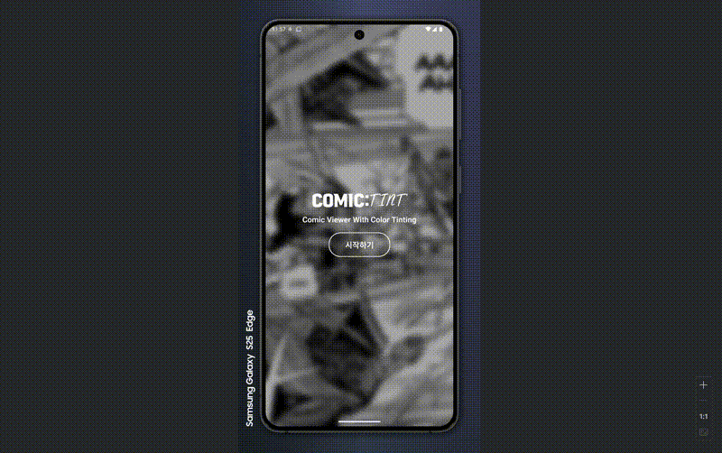

# COMIC:tint



> 만화 컷 자동 인식과 선 추출로, 누구나 쉽게 채색하는 만화 뷰어

ComicTint는 만화 컷을 자동으로 인식·분할하고, 컷 내부의 펜선을 추출해 사용자가 직접 채색할 수 있도록 돕는 만화 뷰어입니다. 읽기 경험과 창작의 즐거움을 한 곳에서 제공하는 차세대 만화 앱입니다.

## ✨ 주요 기능

### 📖 스마트 PDF 뷰어

- **고성능 PDF 렌더링**: 대용량 만화 파일을 빠르고 안정적으로 로드
- **직관적인 네비게이션**: 스와이프 제스처와 터치 컨트롤로 편리한 페이지 이동
- **반응형 인터페이스**: 다양한 화면 크기에 최적화된 읽기 경험

### 🗂️ 효율적인 파일 관리

- **스마트 정렬**: 이름, 날짜, 크기, 최근 열기 순으로 정렬
- **즐겨찾기 시스템**: 자주 읽는 만화를 빠르게 접근
- **최근 파일**: 최근에 열었던 파일들을 한눈에 확인
- **파일 정보**: 상세한 메타데이터와 파일 통계 제공

### 🎨 컬러링 기능 (개발 예정)

- **컷 자동 인식**: OpenCV 기반 만화 컷 분할 및 감지
- **선 추출**: 고품질 라인아트 추출로 채색 준비
- **실시간 컬러링**: 브러시, 팔레트, 레이어 기반 채색 도구
- **프로젝트 저장**: 채색 작업을 저장하고 공유

## 🛠️ 기술 스택

### Frontend

- **React Native 0.82.0** - 크로스 플랫폼 모바일 앱 개발
- **TypeScript** - 타입 안전성과 개발 생산성 향상
- **React Navigation 7** - 네비게이션 관리

### 이미지 처리 & AI

- **OpenCV** - 컷 인식, 선 추출, 이미지 전처리
- **Core ML (iOS)** - 온디바이스 AI 추론
- **NNAPI (Android)** - 네이티브 AI 가속화
- **ONNX Runtime** - 모델 최적화 및 배포

### 데이터 관리

- **AsyncStorage** - 로컬 데이터 저장
- **React Native Blob Util** - 파일 시스템 관리
- **Document Picker** - 파일 선택 및 가져오기

### 개발 도구

- **Jest** - 테스트 프레임워크
- **ESLint & Prettier** - 코드 품질 관리
- **Metro** - 번들러 및 개발 서버

## 📱 화면 구성

### 🏠 홈 화면

- 브랜드 아이덴티티가 반영된 메인 화면
- 만화 이미지 배경과 시작하기 버튼
- 커스텀 폰트를 활용한 브랜딩

### 📋 PDF 목록 화면

- 파일 목록과 정렬 옵션
- 즐겨찾기 및 검색 기능
- 파일 가져오기 및 관리 도구

### 👁️ PDF 뷰어 화면

- 고성능 PDF 렌더링
- 직관적인 페이지 네비게이션

### ⏰ 최근 파일 화면

- 최근에 열었던 파일들 목록
- 빠른 접근을 위한 최적화된 인터페이스

### 💭 추가 예정

- ...

## 🚀 설치 및 실행

### 사전 요구사항

- Node.js >= 20
- React Native 개발 환경 설정
- iOS: Xcode 14+
- Android: Android Studio 및 SDK

### 설치

```bash
# 저장소 클론
git clone https://github.com/your-username/ComicTint.git
cd ComicTint

# 의존성 설치
npm install

# iOS 의존성 설치 (macOS만)
cd ios && pod install && cd ..
```

### 실행

```bash
# Metro 서버 시작
npm start

# iOS 시뮬레이터에서 실행
npm run ios

# Android 에뮬레이터에서 실행
npm run android
```

### 개발 스크립트

```bash
# 린트 검사
npm run lint

# 코드 포맷팅
npm run format

# 포맷 검사
npm run format:check

# 테스트 실행
npm test
```

## 📁 프로젝트 구조

```
ComicTint/
├── src/
│   ├── components/          # 재사용 가능한 UI 컴포넌트
│   │   ├── CustomAlert.tsx  # 커스텀 알림 모달
│   │   ├── PdfListItem.tsx  # PDF 목록 아이템
│   │   ├── RenameModal.tsx  # 파일명 변경 모달
│   │   └── ...
│   ├── hooks/               # 커스텀 React 훅
│   │   ├── useFavorites.ts  # 즐겨찾기 관리
│   │   ├── usePdfImport.ts  # PDF 가져오기
│   │   └── ...
│   ├── screens/             # 화면 컴포넌트
│   │   ├── HomeScreen.tsx
│   │   ├── PdfListScreen.tsx
│   │   └── ...
│   ├── styles/              # 스타일 정의
│   ├── utils/               # 유틸리티 함수
│   ├── storage/             # 데이터 저장소
│   └── models/              # 타입 정의
├── assets/                  # 이미지, 폰트 등 정적 자원
├── android/                 # Android 네이티브 코드
├── ios/                     # iOS 네이티브 코드
└── __tests__/               # 테스트 파일
```

## 🎯 핵심 구현 사항

추가 예정

## 🔮 로드맵

### 1단계 (MVP) - 현재

- ✅ 기본 PDF 뷰어 기능
- ✅ 파일 관리 및 정렬
- ✅ 즐겨찾기 시스템
- ✅ 반응형 UI/UX

### 2단계 (품질 향상) - 개발 예정

- 🔄 클래식 컷 분할 + 기본 선 추출
- 🔄 버킷/브러시/팔레트 컬러링 도구
- 🔄 경량 세그멘테이션 적용
- 🔄 경계 보정 및 갭 클로징 개선

### 3단계 (고급 기능) - 장기 계획

- ⏳ 자동 채색 옵션
- ⏳ 프로젝트 팔레트 공유
- ⏳ 대용량 페이지 타일링/스트리밍 최적화
- ⏳ AI 기반 컷 인식 정확도 향상
